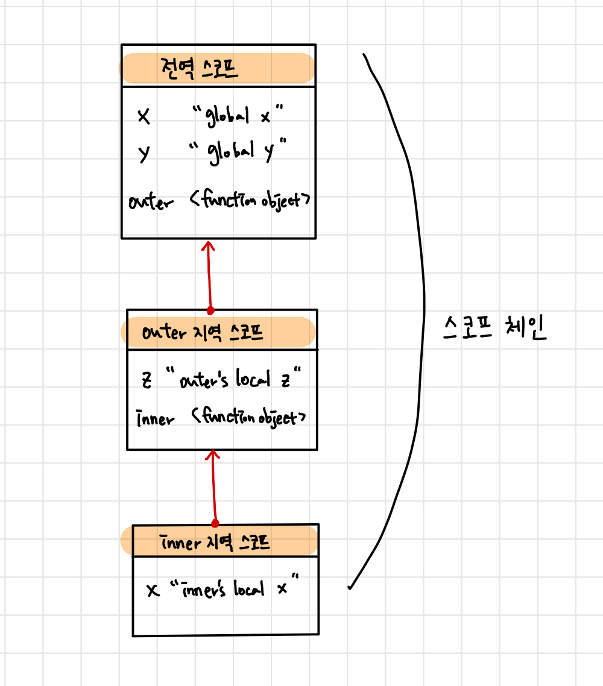

# 스코프
## 1. 스코프란?
- 모든 식별자(변수 이름, 함수 이름, 클래스 이름 등)는 자신이 선언된 위치에 의해 다른 코드가 식별자 자신을 참조할 수 있는 유효 범위가 셜정됨. 
- 이를 스코프라 하며, 스코프는 식별자가 유효한 범위를 칭함
- 스코프는 자바스크립트 엔진이 **식별자를 검색할 때 사용하는 규칙**이라고도 할 수 있음
    - 자바스크립트 엔진은 스코프를 통해 이름이 같은 변수 중 어떤 변수를 참조해야할 것인지 결정
- 자바스크립트 엔진은 코드를 실행할 때 코드의 문맥을 고려

> **코드의 문맥과 환경**
> "코드가 어디서 실행되며 주변에 어떤 코드가 있는지"를 **렉시컬 환경**이라 부름. 즉, 코드의 문맥은 렉시컬 환경으로 이뤄지며, 이를 구현한 것이 **실행 컨텍스트**. 모든 코드는 실행 컨텍스트에서 평가되고 실행되며, 스코프는 실행 컨텍스트와 깊은 관련이 있다.

- Example
    ```javascript
    var x = 'global'; //전역 스코프 
    function foo(){
        var x = 'local'; //foo 함수 스코프 
        console. log(x);
    }
    foo();
    console.log(x);  
    ```
    - 두 개의 x 변수는 식별자 이름이 동일하지만 스코프가 다른 별개의 변수
    - 프로그래밍 언어에서는 스코프(유효 범위)를 통해 식별자인 변수 이름의 충돌을 방지하여 같은 이름의 변수를 사용할 수 있게 함 

## 2. 스코프의 종류
- 코드는 **전역**과 **지역**으로 구분되며, 이때 변수는 자신이 선언된 위치에 의해 스코프가 결정됨
- 전역에서 선언된 변수는 전역 스코프를 갖는 전역 변수이고, 지역에서 선언된 변수는 지역 스코프를 갖는 지역 변수 

### 2.1 전역과 전역 스코프 
- 전역이란 코드의 가장 바깥 영역 
- 전역에 변수를 선언하면 전역 스코프를 갖는 전역 변수가 되며, 전역 변수는 어디서든지 참조할 수 있음

### 2.2 지역과 지역 스코프
- 지역이란 함수 몸체 내부를 말함
- 지역에 변수를 선언하면 지역 스코프를 갖는 지역 변수가 되며, 자신이 선언된 지역과 하위 지역(중첩 함수)에서만 참조할 수 있음
- 지역 변수는 자신의 지역 스코프와 하위 지역 스코프에서만 유효 


## 3. 스코프 체인
- 함수 몸체 내부에서 함수가 정의된 것을 **함수의 중첩**이라 하며, 함수 몸체 내부에서 정의한 함수를 **중첩 함수**, 중첩 함수를 포함하는 함수를 **외부 함수**라 함
- 중첩 함수의 지역 스코프는 중첩 함수를 포함하는 외부 함수의 지역 스코프와 계층적 구조를 가지며, 외부 함수의 지역 스코프를 중첩 함수의 상위 스코프라 함.

```javascript
//전역 스코프
var x = "global x"; //전역 변수 
var y = "global y"; //전역 변수 

function outer(){//지역 스코프 
    var z = "outer's local z";
    function inner(){ //지역 스코프 
        var x = "inner's local x";

    }

    inner()

}

outer();

```
- 해당 예시의 모든 스코프는 다음과 같이 하나의 계층적 구조로 연결되며, 스코프가 계층적으로 연결된 것을 **스코프 체인**이라 함


- 변수를 참조할 때 자바스크립트 엔진은 스코프 체인을 통해 변수를 참조하는 코드의 스코프에서 시작하여 상위 스코프 방향으로 이동하며 선언된 변수를 검색
    - 이를 통해 상위 스코프에서 선언한 변수를 하위 스코프에서도 참조할 수 있음 
- 자바스크립트 엔진은 코드를 실행하기에 앞서 위 그림과 유사한 자료구조인 **렉시컬 환경**을 실제로 생성. 변수 선언이 실행되면 변수 식별자가 렉시컬 환경에 키로 등록되고, 변수 할당이 일어나면 변수 식별자에 해당하는 값을 변경. - 변수의 검색도 해당 렉시컬 환경에서 이뤄짐 
> 스코프 체인은 실행 컨텍스트의 렉시컬 환경을 단방향으로 연결한 것 

## 4. 함수 레벨 스코프
- 함수의 코드 블록(함수 몸체)만을 지역 스코프로 인정하는 것
- var 키워드로 선언된 변수는 함수 레벨 스코프만 인정 

## 5. 렉시컬 스코프
> 함수의 상위 스코프 결정 패턴
> 1. 동적 스코프(dynamic scope): 함수를 어디서 호출했는지에 따라 함수의 상위 스코프를 결정한다.
> 2. 렉시컬 스코프(lexical scope): 함수를 어디서 정의했는지에 따라 함수의 상위 스코프를 결정한다. 

- 자바스크립트는 렉시컬 스코프를 따르므로 함수를 어디서 호출했는지가 아니라 함수를 어디서 정의했는지에 따라 상위 스코프를 결정
- 따라서 함수의 상위 스코프는 함수 정의가 실행될 때 정적으로 결정되며, 함수 정의가 실행되어 생성된 함수 객체는 함수가 호출될 때마다 함수의 상위 스코프를 참조할 필요가 있어 상위 스코프를 기억함 
