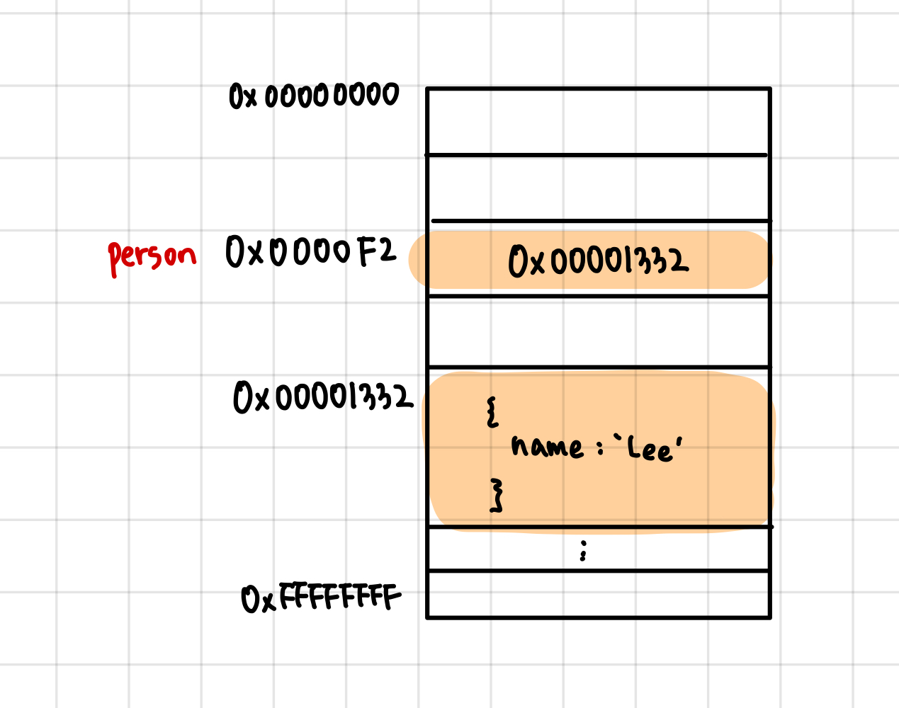
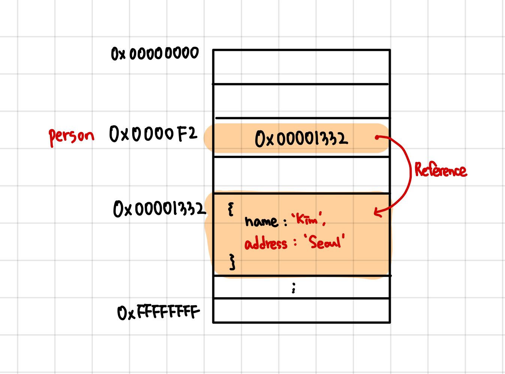

# ⚖️ 원시 값과 객체의 비교

> 원시 값과 객체는 크게 3가지 측면에서 다르다.
> 1. 원시 값은 변경 불가능한 값, 객체는 변경 가능한 값
> 2. 원시 값을 변수에 할당하면 변수(확보된 메모리 공간)에는 실제 값이 저장, 객체를 변수에 할당하면 변수에는 참조 값이 저장됨
> 3. 원시 값을 갖는 변수를 다른 변수에 할당하면 원본의 원시 값이 복사되어 잔달됨(**값에 의한 전달**), 객체를 가리키는 변수를 다른 변수에 할당하면 원본의 참조 값이 복사되어 전달(**참조에 의한 전달**)

## 1. 원시 값
### 1.1 변경 불가능한 값
- 한번 생성된 원시 값은 읽기 전용 값으로서 변경할 수 없음
- 따라서 변수는 원시 값 자체를 변경하는 것이 아닌 재할당을 통해 변수 값을 교체한다고 볼 수 있음 
    - 재할당 시 새로운 메모리 공간을 확보하고, 재할당한 원시 값을 저장한 후 변수는 새롭게 재할당한 원시 값을 가리킴 
    - 이때 변수가 참조하던 메모리 공간의 주소가 바뀐다 
- 이러한 원시 값의 특성(불변성)은 데이터의 신뢰성을 보장 

### 1.2 문자열과 불변성
- 원시 값을 저장하려면 먼저 확보해야 하는 메모리 공간의 크기를 결정해야 함
    - 이를 위해 원시 타입별로 메모리 공간의 크기가 미리 정해져 있음
- 원시 값인 문자열은 0개 이상의 문자로 이뤄진 집합을 말하며, 1개의 문자는 2바이트의 메모리 공간에 저장됨 
    - 따라서 문자열은 몇 개의 문자로 이뤄졌느냐에 따라 필요한 메모리 공간의 크기가 결정됨 
- 문자열은 유샤 배열 객체
    - 유사 배열 객체란 마치 배열처럼 인덱스로 프로퍼티 값에 접근할 수 있고 length 프로퍼티를 갖는 객체를 말함 
    - 인덱스를 사용해 각 문자에 접근할 수 있지만 일부 문자를 변경해도 반영되지 않음
```javascript
var str = 'string';

//문자열은 원시 값이므로 변경할 수 없다. 이때 에러가 발생하지 않는다 
str[0] = 'S';
console.log(str);
```

### 1.3 값에 의한 전달
- 변수에 변수를 할당했을 때 무엇이 전달되는가?
    - 변수에 원시 값을 갖는 변수를 할당하면 할당받는 변수에는 할당되는 변수의 원시 값이 복사되어 전달됨(값에 의한 전달)
```javascript
var score = 80;
//copy 변수에는 score의 값 80이 복사되어 전달됨
//2가지 평가 방식으로 평가 가능
//1. 새로운 80을 생성(복사)해서 메모리 주소를 전달하는 방식. 이 방식은 할당 시점에 두 변수가 기억하는 메모리 주소가 다르다.
//2. score의 변수값 80의 메모리 주소를 그대로 전달하는 방식. 이 방식은 할당 시점에 두 변수가 기억하는 메모리 주소가 같다. 한 변수에 재할당 시 그 변수의 메모리 주소가 변동된다. 
var copy = score;

console.log(score, copy); //80 80
console.log(score === copy);// true


// score 변수와 copy 변수의 값은 다른 메모리 공간에 저장된 별개의 값이다.
// 따라서 score 변수의 값을 변경해도 copy 변수의 값에는 어떠한 영향도 주지 않는다.
score = 100;
console.log(score, copy); // 100 80
console.log(score === copy); // false
```
- 두 변수의 원시 값은 서로 다른 메모리 공간에 저장된 별개의 값이 되어 어느 한쪽에서 재할당을 통해 값을 변경하더라도 서로 간섭할 수 없음

## 2. 객체
- 객체는 프로퍼티 개수가 정해져 있지 않으며 동적으로 추가/삭제 될 수 있으므로 확보해야 할 메모리 공간의 크기를 사전에 정해둘 수 없음
- 자바, C++ 같은 클래스 기반 객체지향 프로그래밍 언언느 사전에 정의된 클래스를 기반으로 객체를 생성. 하지만 자바스크립트는 클래스 없이 객체를 생성할 수 있음 → 프로퍼티 접근에 비용이 더 많이 드는 비효율적인 방식
- 따라서 V8 자바스크립트 엔진에서는 프로퍼티에 접근하기 위해 동적 탐색 대신 **히든 클래스**라는 방식을 사용해 C++객체의 프로퍼티에 접근하는 정도의 성능을 보장 

### 2.1 변경 가능한 값
- 객체는 변경 가능한 값 
- 객체를 할당한 변수에는 생성된 객체가 실제로 저장된 메모리 공간에 주소(참조값)가 저장되어 있음 
- 변수는 이 참조 값을 통해 객체에 접근함 

```javascript
var person = {
    name: 'Lee'
}

```
<p align="center">
    
</p>

- 객체는 변경 가능한 값이므로 메모리에 저장된 객체를 직접 수정할 수 있음
- 이때 객체를 할당한 변수에 재할당을 하지 않았으므로 객체를 할당한 변수의 참조값은 변경되지 않음 
```javascript
var person = {
    name: 'Lee'
}

person.name = 'Kim';
person.address = 'Seoul';

```
<p align="center">
    
</p>

> 객체의 구조적 단점: 원시 값과 다르게 여러 개의 식별자가 하나의 객체를 공유할 수 있음

#### 얕은 복사와 깊은 복사
- 객체를 프로퍼티 값으로 갖는 객체의 경우 얕은 복사는 한 단계까지만 복사하는 것을 말하고, 깊은 복사는 중첩되어 있는 객체까지 모두 복사하는 것을 말함
- 얕은 복사와 깊은 복사로 생성된 복사본은 원본과 참조 값이 다른 별개의 객체다
- 하지만 얕은 복사는 객체에 중첨되어 있는 객체의 경우 참조 값을 복사하고, 깊은 복사는 객체에 중첩되어 있는 객체까지 모두 복사해서 원시 값처럼 완전한 복사본을 만든다는 차이가 있음 

### 2.2 참조에 의한 전달
- 객체를 가리키는 변수(원본, person)을 다른 변수(사본, copy)에 할당하면 원본의 참조 값이 복사되어 전달됨 
- 따라서 원본 또는 사본 중 어느 한쪽에서 객체를 변경하면 서로 영향을 주고 받는다 
```javascript
var person = {
    name: 'Lee'
}

var copy = person;
```