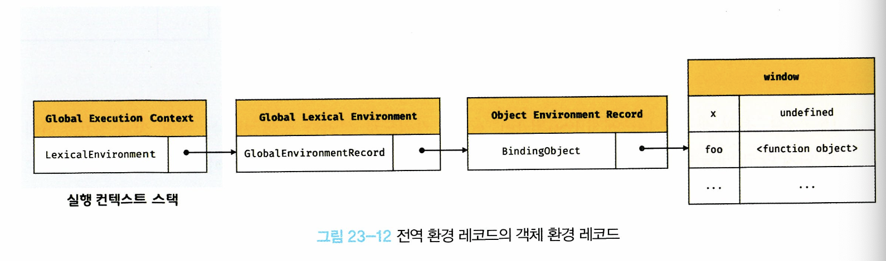

 # 실행 컨텍스트

> JavaScript 엔진은 소스코드 평가와 실행 단계를 거쳐 코드를 처리한다. 이때 핵심 개념은 실행 컨텍스트, 렉시컬 환경, 그리고 실행 컨텍스트 스택이다.

## 🔍 소스코드의 타입
코드가 어떤 타입으로 실행되느냐에 따라 생성되는 실행 컨텍스트가 달라진다:
- 전역 코드: 전역에 존재하는 소스 코드
- 함수 코드: 함수 내부에 존재하는 소스코드
- eval 코드: 빌트인 전역 함수인 eval 함수에 인수로 전달되어 실행되는 소스 코드
- 모듈 코드: 모듈 내부에 존재하는 소스 코드 
- 이때, 각 영역 내부의 함수, 클래스 등의 내부 코드는 포함하지 않음 

> ⚠️ 타입별로 스코프 생성 시점과 관리 방식이 달라진다.

<br/>

## 📑 소스코드의 평가와 실행 
자바스크립트 엔진은 소스코드를 **평가**와 **실행** 2개의 과정으로 나누어 처리한다 
1. 평가 단계
    - 실행 컨텍스트 생성
    - 변수·함수 선언만 먼저 스코프에 등록(호이스팅)
2. 실행 단계
    - 런타임이 시작되면 선언문을 제외한 코드를 순차 실행
    - 필요할 때마다 스코프에서 식별자 참조
    - 실행 결과(값 변경 등)를 스코프에 반영

<br/>

```Javascript
var x; // 평가 단계에서 등록 → undefined  
x = 1; // 실행 단계에서 할당  
```

<br/>

- 소스 코드의 실행에서 필요한 환경 
1. 선언에 의해 생성된 식별자를 스코프로 구분하여 등록하고 상태 변화를 지속적으로 관리할 수 있어야함
2. 스코프는 중첩 관계에 의해 스코프 체인을 형성해야 함.
- 스코프 체인을 통해 상위 스코프로 이동하며 식별자를 검색할 수 있어야 함
3. 현재 실행 중인 코드의 실행 순서를 변경할 수 있어야 하며 다시 되돌아갈 수도 있어야 함

<br/>

## 실행 컨텍스트의 역할
- 소스코드를 실행하는 데 필요한 환경을 제공하고 코드의 실행 결과를 관리하는 영역
- 식별자(변수, 함수, 클래스 등의 이름)을 등록하고 관리하는 **스코프**와 **코드 실행 순서 관리**를 구현한 **내부 메커니즘**으로, **모든 코드는 실행 컨텍스트를 통해 실행되고 관리됨**
- 식별자와 스코프는 실행 컨텍스트의 **렉시컬 환경**으로 관리하고, 코드의 실행 순서는 **실행 컨텍스트 스택**으로 관리

<br/>

## 실행 컨텍스트 스택 
- 생성된 실행 컨텍스트를 관리하는 스택 자료구조로 **코드의 실행 순서**를 관리 
```Javascript
const x = 1;
function foo(){
    const y = 2;
    function bar(){
        const z = 3;
        console.log(x + y + z);
    }
    bar();
}
foo();
//전역코드와 함수 코드로 구성된 코드
//먼저 전역 코드 평가 후 전역 실행 컨텍스트 생성, 이후 함수가 호출되면 함수 코드를 평가하여 함수 실행 컨텍스트 생성 
```
- 동작 과정
1. 전역 코드의 평가와 실행
    - (평가) 전역 실행 컨텍스트 생성, 실행 컨텍스트 스택에 Push
        - 전역 변수 x, 전역 함수 foo가 전역 실행 컨텍스트에 등록됨
    - (실행) 전역변수 x에 값 할당, 전역 함수 foo 호출
    - 전역 코드의 실행 일시 중단
2. foo 함수 코드의 평가와 실행
    - (평가) foo 함수 실행 컨텍스트 생성, 실행 컨텍스트 스택에 Push
        - foo 함수의 지역 변수 y, 중첩 함수 bar가 foo 함수 실행 컨텍스트에 등록
    - (실행) 지역 변수 y에 값 할당, 중첩 함수 bar 호출
    - foo 함수 코드 실행 일시 중단 
3. bar 함수 코드의 평가와 실행
    - (평가) bar 함수 실행 컨텍스트 생성, 실행 컨텍스트 스택에 Push
        - bar 함수의 지역 변수 z가 bar 함수 실행 컨텍스트에 등록
    - (실행) 지역 변수 z에 값 할당, console.log 메서드 호출 이후 함수 종료 
4. bar 함수 실행 컨텍스트를 실행 컨텍스트 스택에서 Pop
5. foo 함수 실행 컨텍스트를 실행 컨텍스트 스택에서 Pop
5. 전역 컨텍스트를 실행 컨텍스트 스택에서 Pop

- 실행 컨텍스트 스택의 최상위에 존재하는 실행 컨텍스트는 현재 실행 중인 코드의 실행 컨텍스트로 실행 중인 실행 컨텍스트라 부름 


<br/>

## 렉시컬 환경
- 식별자와 식별자에 바인딩된 값, 상위 스코프에 대한 참조를 기록하는 자료구조로 실행 컨텍스트를 구성하는 컴포넌트
- 키와 값을 갖는 객체 형태의 스코프를 생성하여 식별자를 키로 등록하고 식별자에 바인딩된 값을 관리

     출처: https://jhbljs92.tistory.com/entry/%EC%8B%A4%ED%96%89-%EC%BB%A8%ED%85%8D%EC%8A%A4%ED%8A%B8-%EB%A0%89%EC%8B%9C%EC%BB%AC-%ED%99%98%EA%B2%BD-%EB%82%B4%EC%9A%A9%EC%A0%95%EB%A6%AC

- 렉시컬 환경의 구성 컴포넌트
    1. 환경 레코드
    - 스코프에 포함된 식별자를 등록하고 등록된 식별자에 바인딩된 값을 관리하는 저장소
    2. 외부 렉시컬 환경에 대한 참조
    - 외부 렉시컬 환경에 대한 참조는 상위스코프를 가리킴
        - 상위스코프: 해당 실행 컨텍스트를 생성하느소스코드를 포함하는 상위 코드의 렉시컬 환경
    - 외부 렉시컬 환경에 대한 참조를 통해 단방향 링크드 리스트인 스코프체인을 구현 

<br/>

## 실행 컨텍스트의 생성과 식별자 검색 과정
```Javascript
const x = 1;
function foo(){
    const y = 2;
    function bar(){
        const z = 3;
        console.log(x + y + z);
    }
    bar();
}
foo();
//전역코드와 함수 코드로 구성된 코드
//먼저 전역 코드 평가 후 전역 실행 컨텍스트 생성, 이후 함수가 호출되면 함수 코드를 평가하여 함수 실행 컨텍스트 생성 
```
### 1. 전역 객체 생성
- 전역 객체는 전역 코드가 평가되기 이전에 생성됨
### 2. 전역 코드 평가 
1. 전역 실행 컨텍스트 생성
- 호스트(environment)에 의해 생성
    - 자바스크립트 엔진이 시작되기 전, 브라우저 환경에서는 window 객체를, Node.js 환경에서는 global 객체를 미리 생성
- 내장 프로퍼티 추가
    - 전역 내장 함수: eval, isNaN, parseInt 등
    - 전역 내장 객체: Array, Object, Promise 등
2. 전역 렉시컬 환경 생성
- 전역 렉시컬 환경을 생성하고, **전역 실행 컨텍스트**에 바인딩 
    2-1. 전역 환경 레코드 생성
    - 객체 환경 레코드, 선언적 환경 레코드로 구성
    - 객체 환경 레코드 (Object Environment Record)
        - var 키워드로 선언된 전역 변수, 함수 선언문으로 정의된 전역 함수가 이 레코드의 바인딩 객체(Binding Object)에 등록됨
        - 예) 전역에 var x = 1; function foo() {}가 있으면, BindingObject.x와 BindingObject.foo가 만들어짐
    
    - 선언적 환경 레코드: let, const 키워드로 선언한 전역 변수
        - 이들은 TDZ(Temporal Dead Zone) 메커니즘이 적용되어, 첫 할당 전까지 접근 시 참조 에러가 발생 
    2-2. this 바인딩
        - 전역 컨텍스트에서 this는 전역 객체(window 또는 global)를 가리킴
    2-3. 외부 렉시컬 환경에 대한 참조 결정 
        - 전역 렉시컬 환경은 최상위이므로, 외부 참조(outer reference)는 null
3. foo() 호출
- 전역 실행 컨텍스트가 일시 중단되고, 새로운 foo 함수 실행 컨텍스트가 생성

4. foo의 렉시컬 환경 생성
    - 객체 환경 레코드: 전역에서는 사용되지 않고, 함수 내부 this 바인딩용 객체가 준비될 수 있으나 ES6 모듈 모드라면 this는 undefined가 됨
    - 선언적 환경 레코드:
        - const y
        - 선언된 중첩 함수 bar
    - 외부 렉시컬 환경 참조: 전역 렉시컬 환경을 가리킴
4. foo 함수 본문 실행 
- const y = 2; 선언적 환경 레코드에 y가 바인딩되고, 값 2로 초기화
- function bar() { … } 선언적 환경 레코드에 중첩 함수 bar가 바인딩
- bar(); 호출: foo 실행 컨텍스트가 일시 중단되고, 다음으로 bar 함수 실행 컨텍스트가 생성되어 스택에 쌓임

5. bar의 렉시컬 환경 생성 
- 선언적 환경 레코드:
    - const z
- 외부 렉시컬 환경 참조: foo의 렉시컬 환경을 가리킴

6. 함수 본문 실행
- const z = 3; 선언적 환경 레코드에 z가 바인딩되고, 3으로 초기화
- console.log(x + y + z);
    - 식별자 검색(스코프 체인)
        z → bar 환경에서 찾음
        y → 외부(foo) 환경에서 찾음
        x → 최상위(전역) 환경에서 찾음
        세 값을 합산하여 콘솔에 출력합니다.
6. 컨텍스트 정리
- bar, foo, 전역 실행 컨텍스트 순서대로 pop

## 실행 컨텍스트와 블록 레벨 스코프
var 키워드로 선언한 변수는 오로지 함수의 코드 블록만 지역 스코프로 인정하는 함수 레벨 스코프를 따른다.
하지만 let, const 키워드로 선언한 변수는 모든 코드 블록 (함수, if 문, for 문, 등등)을 지역 스코프로 인정하는 블록 레벨 스코프를 따른다.

## 📌 핵심 정리
- 실행 컨텍스트 스택은 코드 실행 순서를 관리한다
- 각 실행 컨텍스트는 자신만의 렉시컬 환경(스코프)을 가진다
- 렉시컬 환경은 환경 레코드와 외부 참조로 구성된다
- 식별자 검색은 **스코프 체인(단방향)** 을 통해 상위 스코프로 이동하며 이뤄진다
- var는 함수 레벨 스코프, let·const는 블록 레벨 스코프를 따른다


### 참고자료
https://medium.com/@heoh06/%EC%9E%90%EB%B0%94%EC%8A%A4%ED%81%AC%EB%A6%BD%ED%8A%B8-%EB%A0%89%EC%8B%9C%EC%BB%AC-%ED%99%98%EA%B2%BD-9e6780022c5e
https://jhbljs92.tistory.com/entry/%EC%8B%A4%ED%96%89-%EC%BB%A8%ED%85%8D%EC%8A%A4%ED%8A%B8-%EB%A0%89%EC%8B%9C%EC%BB%AC-%ED%99%98%EA%B2%BD-%EB%82%B4%EC%9A%A9%EC%A0%95%EB%A6%AC