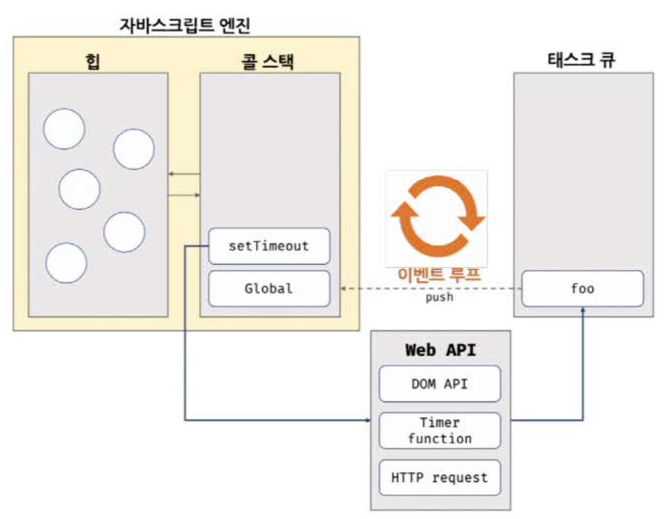

# 비동기 프로그래밍(Asynchronous Programming)

JavaScript는 **싱글 스레드**로 동작하지만, **이벤트 루프(Event Loop)**와 **태스크 큐(Task Queue)** 덕분에 마치 여러 작업이 동시에 실행되는 것처럼 보인다.  
여기서는 동기 처리와 비동기 처리의 차이, 그리고 이벤트 루프와 태스크 큐의 동작 방식을 살펴본다.

## 🔄 1. 동기 처리와 비동기 처리

- 자바스크립트 엔진은 단 하나의 **실행 컨텍스트 스택**만 가지고 있어, 한 번에 하나의 태스크만 실행할 수 있다.
- **동기 처리**

  - 태스크를 순서대로 하나씩 실행
  - 앞선 태스크가 완료될 때까지 다음 태스크는 **블로킹**
  - **장점**: 실행 순서 보장
  - **단점**: 느린 작업이 전체 흐름을 멈추게 함

- **비동기 처리**
  - `setTimeout`, `setInterval`, HTTP 요청, 이벤트 핸들러 등
  - 현재 태스크가 끝나지 않아도 다음 태스크를 즉시 예약
  - **장점**: 블로킹이 없어서 UI 반응성 유지
  - **단점**: 실행 순서가 보장되지 않음

```js
console.log("시작");

setTimeout(() => {
  console.log("1초 후 실행");
}, 1000);

console.log("다음 작업");
```

<br/>

## 🔁 2. 이벤트 루프와 태스크 큐

브라우저는 멀티스레드로 동작하고, 자바스크립트 엔진 외에 **Web API**(타이머, HTTP, DOM 등)를 제공한다.
이 Web API가 비동기 요청을 처리하고, 콜백을 **태스크 큐**에 넣으면 **이벤트 루프**가 이를 콜 스택으로 가져와 실행한다.

### 2.1 브라우저 환경 구조


출처: https://velog.io/@kingmo/Event-Loop

1. **콜 스택(Call Stack)**

   - 실행 컨텍스트 스택

2. **힙(Heap)**

   - 객체가 저장되는 메모리

3. **Web API**

   - 별도 스레드에서 비동기 작업 처리

4. **태스크 큐(Task Queue)**

   - 비동기 콜백을 보관

5. **이벤트 루프(Event Loop)**

   - 콜 스택이 비어 있으면 태스크 큐에서 콜백을 꺼내 실행

### 2.2 동작 플로우

1. **코드 실행** → 콜 스택에 컨텍스트 푸시
2. `setTimeout` 호출 → Web API로 타이머 설정
3. 타이머 만료 후 콜백을 **태스크 큐**에 푸시
4. **이벤트 루프**가 콜 스택이 비어 있는지 체크
5. 비어 있으면 태스크 큐에서 콜백을 꺼내 콜 스택에 푸시 → 실행

> 주의: setTimeout에 지정한 지연시간은 최소 대기시간이다.
> 콜 스택에 다른 작업이 남아 있으면, 타이머가 만료된 뒤에도 콜백이 실제로 실행되기까지 더 오래 걸릴 수 있다.

```plaintext
코드 실행 → 콜 스택 → Web API → 태스크 큐 → 이벤트 루프 → 콜 스택 → 실행
```

## ✔️ 요약

- **싱글 스레드** 자바스크립트: 한 번에 하나의 실행 컨텍스트
- **동기 처리**: 순차 실행, 블로킹 발생, 실행 순서 보장
- **비동기 처리**: 블로킹 없음, 순서 비보장
- **이벤트 루프 + 태스크 큐**: 비동기 콜백을 순차적으로 처리
- **Web API**: 브라우저가 제공하는 비동기 처리 엔진

이 구조를 이해하면, 비동기 API나 라이브러리를 사용할 때 **실행 순서**와 **성능 최적화**를 더 효과적으로 관리할 수 있다.
